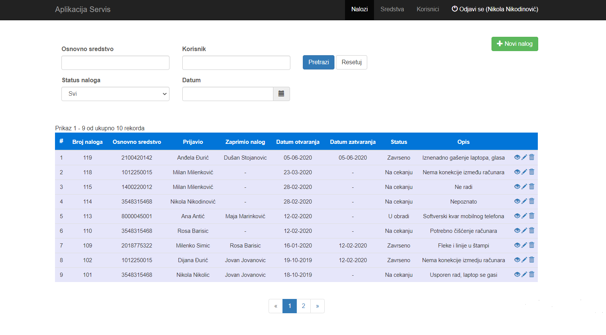

## Table of contents
* [General info](#general-info)
* [Technologies](#technologies)
* [Screenshots](#Screenshots)
* [Features](#Features)

## General info

This application "Service" is used to monitor the process of servicing companies fixed assets 
(grouped into the categories of laptops, computers, computer devices, telephones, etc.) as well
as interventions created for this purpose and users who participated in this process. 
Users can have the role of: administrator, servicer and user.

The application was created for the purpose of understanding the MVC architecture and in general,
the way PHP frameworks work.
	
## Technologies
Project is created with:
* HTML5, CSS3
* Bootstrap: 3.4
* Javascript, AJAX
* PHP: 7.2.5
* PHP framework Yii: version 2.0.30

## Screenshots
* Home page with listed existing interventions and search filters.

* Detailed review of intervention.

* Creating new intervention.

* Page with listed assets and search filters.

* Creating a new fixed asset with all its configurations.

* Adding a new user and assigning a role.

* Detailed overview of user data and interventions in which it is involved.

* Adding a new sector.

* Setting assets category with its attributes.

* Setting attributes possible values.

## Features
* CRUD for all elements of application
* Authentication
* Authorization RBAC